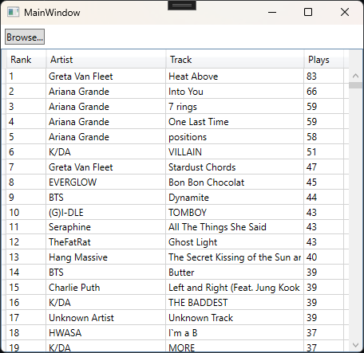
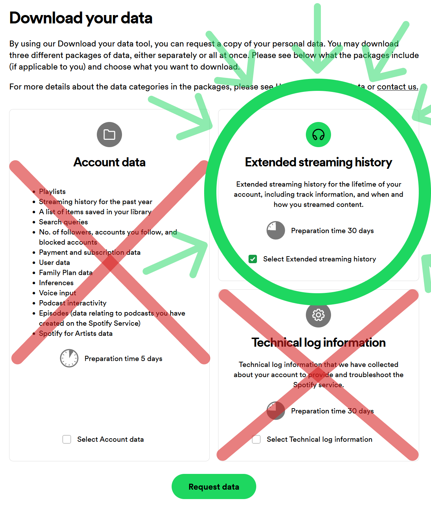

# Spotify Insights
Each year, Spotify Wrapped shows its users some nice graphics that summarizes that year's listening habits. I always find myself wanting a more in-depth analysis than what Wrapped offers. Spotify Insights allows me to see those stats I've always wanted to see. It's not as pretty as Wrapped, but it gets the data I'm interested in.

## How to Use

1. Download a release from the [Releases](https://github.com/WestRyanK/SpotifyInsights/releases) tab.
2. Run the app and click `Browse...`.
3. Select all your `StreamingHistory.json` files.
4. View the results.

## How to Get Spotify Data

1. Open the [Spotify Privacy Page](https://www.spotify.com/us/account/privacy/).
2. Scroll down to the "Download your data" section.
3. Tick the "Select Extended streaming history" box.
4. Click "Request Data".
5. Wait up to 30 days for an email from Spotify that contains a link to your data.
6. Once you receive the email, download the data and extract it.

